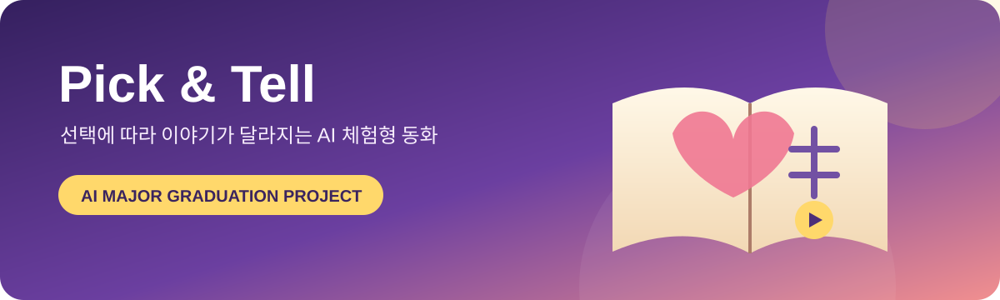
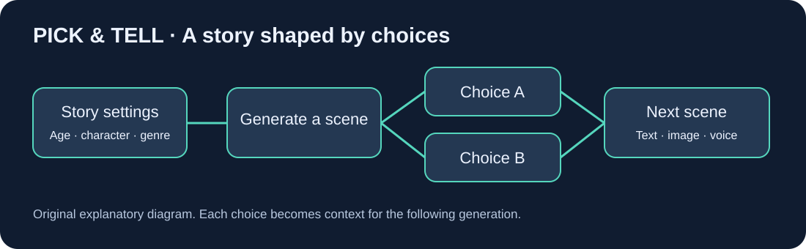
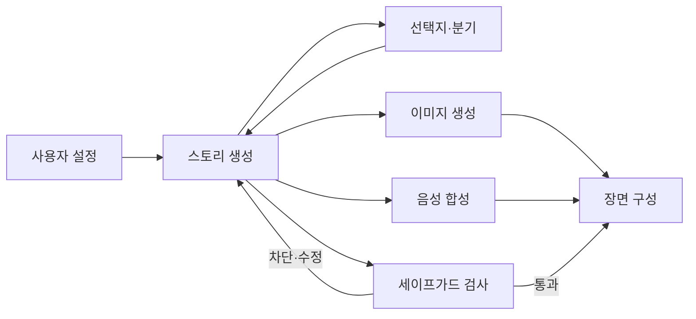
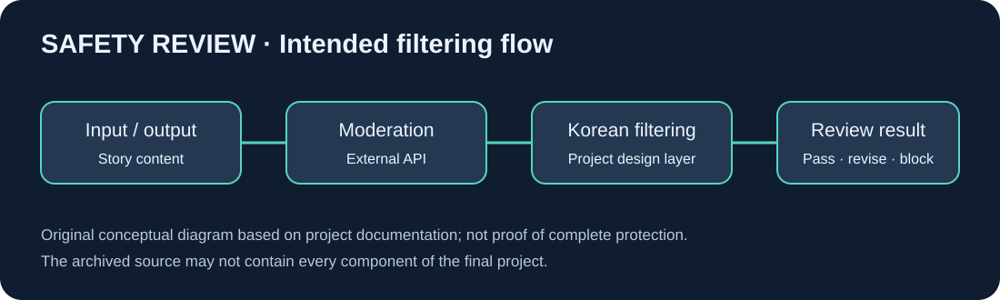

# Pick & Tell

  

> 사용자의 설정과 선택에 반응해 이야기·삽화·음성을 생성하는 인공지능전공 졸업작품입니다.

## 프로젝트 설명

정형화된 동화 대신 아이가 주인공과 배경을 정하고, 이야기 중간의 선택지를 통해 다음 장면을 직접 결정하는 체험형 동화를 기획했습니다. 생성형 AI를 텍스트·이미지·음성 파이프라인으로 연결하면서도, 어린이 대상 콘텐츠에 필요한 유해 표현 필터링을 별도의 안전 계층으로 구성했습니다.

## 주요 기능

- 사용자 입력을 반영한 맞춤형 동화 생성
- 선택지에 따라 다음 장면이 달라지는 분기형 진행
- 장면별 이미지 생성과 시각적 일관성 유지
- ElevenLabs 기반 음성 복제·합성
- 장면과 분위기에 맞춘 배경음악 결합
- OpenAI Moderation 및 한국어 혐오 표현 모델 기반 세이프가드

## 인터랙티브 흐름

  

사용자가 이야기의 기본 설정을 입력하면 첫 장면을 생성하고, 각 장면의 선택 결과를 다음 프롬프트에 포함해 맥락을 이어갑니다. 선택지는 단순 화면 이동이 아니라 이후 텍스트·이미지·음성 생성의 조건으로 사용됩니다.

## 생성 및 안전 파이프라인

  

## 개발 과정

1. 개인화 동화의 입력 항목과 사용자 흐름을 정의했습니다.
2. 스토리·이미지·TTS 후보 API의 품질과 연동 방식을 비교했습니다.
3. 한 장면을 생성하는 파이프라인을 구성한 뒤 선택지·분기 구조로 확장했습니다.
4. ElevenLabs 음성 클로닝과 장면별 음성 생성을 연결했습니다.
5. 부적절한 입력과 생성 결과를 차단하기 위해 다단계 필터링을 적용했습니다.
6. 생성된 텍스트·이미지·음악·음성을 Django 화면에서 하나의 동화 경험으로 결합했습니다.

## 담당 역할

- 프로젝트에 사용할 데이터와 생성 API 탐색·연결
- ElevenLabs 음성 클로닝과 TTS 연동
- 인터랙티브 동화의 선택지·분기 구조 설정
- 세이프가드 필터링 설계 및 구현

## 기술 구성

| 영역 | 기술 |
|---|---|
| Web | Django, HTML, CSS, JavaScript |
| Story | OpenAI API |
| Image | 이미지 생성 API |
| Voice | ElevenLabs |
| Safety | Moderation API, 한국어 유해 표현 분류 모델 |

## 프로젝트 범위 및 유의사항

- 공개본의 `static/audios/sample.mp3`는 직접 합성한 4초 테스트음입니다. 사람의 녹음·복제 음성·상용 음악을 포함하지 않으며, 원래 음성이나 동화 낭독 품질을 보여주는 데모가 아닙니다. 자동 재생은 해제했습니다.
- 발표 캡처는 직접 작성한 설명용 SVG로 교체했습니다. 외부 구성요소의 출처와 이용 조건은 [THIRD_PARTY_NOTICES.md](THIRD_PARTY_NOTICES.md)에 정리했습니다.

- 가천대학교 인공지능전공 P-실무프로젝트 졸업작품의 팀 결과물입니다.
- 별도의 오픈소스 라이선스를 부여하지 않았으며, 코드와 생성 파이프라인의 재사용·재배포를 허가하는 저장소가 아닙니다.
- README의 담당 역할은 개인 기여 범위를 나타내며 전체 결과물은 팀 공동 작업입니다.
- API 키, 음성 원본, 생성 미디어, SQLite DB, 사용자 입력과 팀원 개인 정보는 제외했습니다.
- 음성 복제는 반드시 당사자의 명시적인 동의를 전제로 사용해야 합니다.
- 세이프가드는 위험을 줄이기 위한 수업용 구현이며 모든 유해 콘텐츠를 완전히 탐지한다고 보장하지 않습니다.
- 생성 결과의 사실성·저작권·연령 적합성을 보장하는 상용 서비스가 아닙니다.
