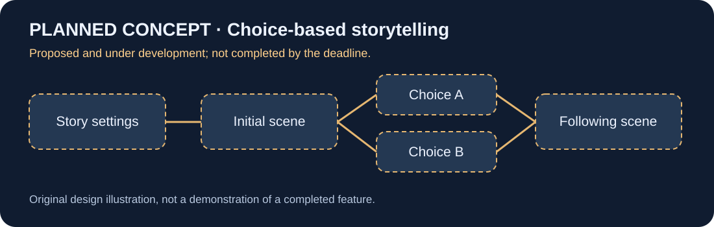
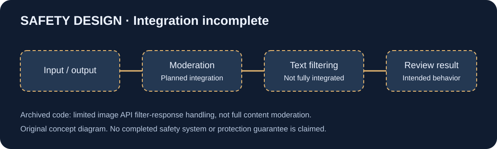

# Pick & Tell

  

> 사용자 설정을 바탕으로 이야기·삽화·음성을 생성하는 동화를 기획·개발한 인공지능전공 졸업작품입니다. **선택지 기반 줄거리 분기는 제안 후 구현을 진행했으나 프로젝트 기한 내 완성하지 못했습니다.**

## 프로젝트 설명

아이가 주인공과 배경을 정하고 이야기 중간의 선택으로 다음 장면을 결정하는 체험형 동화를 목표로 했습니다. 공개 코드에는 동화·이미지·TTS 생성 연결과 화면 구성, 그리고 분기 등 확장 기능의 개발 중 코드가 함께 남아 있습니다. 기획 범위 전체가 구현된 서비스는 아닙니다.

아래 상태는 팀의 미완성 기능 정리 자료, 본인의 설명, 공개 코드의 정적 확인을 함께 반영했습니다. 이번 정리에서 외부 API를 호출하거나 전체 서비스를 실행 검증하지 않았습니다.

## 기능과 구현 상태

| 항목 | 공개 코드와 프로젝트 상태 |
|---|---|
| 맞춤형 동화·장면 이미지·TTS | 생성 호출 및 화면 연결 코드 존재. 현재 전체 동작 재검증은 하지 않음 |
| 선택지 기반 줄거리 분기 | **미완성**. 본인이 제안하고 구현에 참여했으나 기한 문제로 완료하지 못함. 분기 처리·선택지 UI 코드는 개발 흔적 |
| 이미지 일관성 | **부분 구현**. 일관성을 위한 처리 시도가 있으나 결과 보장이나 완성 기능으로 표현하지 않음 |
| 콘텐츠 필터링 | **미완성/부분 구현**. 이미지 API의 필터 응답 처리는 있으나, 텍스트 전후처리와 통합 Moderation 완성은 확인되지 않음 |
| 장면별 BGM 삽입·제어 | **미완성**. 생성 함수와 정적 오디오 요소의 존재를 기능 완성으로 간주하지 않음 |
| BGM 음량 조절·ON/OFF | **미구현**. TTS 재생 버튼과 구분 |
| TTS 목소리 선택 | **미구현**. TTS 호출과 사용자 목소리 선택 UI는 별개 |
| 퀴즈·미니게임 | **미구현** |
| 부모·자녀 대화 카드 | **미완성**. 생성 함수와 화면 요소는 있으나 최종 기능으로 완료하지 못함 |

코드 위치와 판정 근거는 [기능 상태 문서](docs/implementation-status.md)에 정리했습니다.

## 인터랙티브 동화: 기획한 흐름

  

선택 결과를 다음 프롬프트에 포함해 장면을 이어 가는 구조를 제안했습니다. 선택지를 요청하는 프롬프트, 세션 상태, 분기 처리 함수와 UI를 작성하는 과정까지 진행했지만, **완성된 분기 기능으로 제공한 것은 아닙니다.** 위 도식은 기획 설명입니다.

## 생성 코드와 안전 설계의 구분

공개 코드에는 이야기 → 장면 이미지·TTS → 페이지 표시를 위한 함수들이 있습니다. 반면 입력과 출력 전체에 Moderation을 적용하고 차단·재생성하는 통합 안전 흐름은 완료했다고 확인할 수 없습니다.

  

이미지 생성 API의 필터 응답을 처리하는 코드만으로 어린이 대상 콘텐츠의 안전성을 보장하지 않습니다. 분류 모델·Moderation을 포함한 아래 기술 목록도 연동 완료 목록이 아니라 코드와 기획을 구분한 목록입니다.

## 개발 과정과 담당 역할

- 프로젝트에 사용할 데이터와 생성 API를 탐색하고 연결 작업을 담당했습니다.
- ElevenLabs 음성 클로닝과 TTS 연동을 담당했습니다. 공개 코드에는 TTS 호출이 있으며 음성 등록 과정 전체는 포함되어 있지 않습니다.
- 인터랙티브 동화의 **선택지·분기 기능을 제안하고 구현을 진행**했습니다. 프로젝트 기한 때문에 완성하지 못했습니다.
- 세이프가드 필터링 설계와 관련 작업을 담당했습니다. **통합 필터링 전체를 완성한 성과로 주장하지 않습니다.**

프로젝트 전체는 팀 공동 작업이며 위 내용은 개인 담당 범위입니다. 함수나 화면 요소가 남아 있다는 사실과 최종 기능의 완성 여부는 별도로 구분했습니다.

## 기술 구성

| 영역 | 기술 및 범위 |
|---|---|
| Web | Django, HTML, CSS, JavaScript |
| Story / Image / TTS | OpenAI, Stability AI, ElevenLabs API 호출 코드 |
| Music | Mubert 연동 시도 코드, 기능 미완성 |
| Safety | 이미지 API 필터 응답 처리 일부 존재. Moderation 및 한국어 유해 표현 분류는 기획·부분 작업 범위 |

## 공개 범위 및 유의사항

- `static/audios/sample.mp3`는 공개본용 4초 합성 테스트음입니다. 실제 낭독·음성 복제·상용 음악 샘플이 아니며 자동 재생하지 않습니다. BGM 기능의 완성 증거도 아닙니다.
- 설명용 SVG는 직접 작성한 도식이며 실제 동작 화면이 아닙니다. 외부 구성요소는 [THIRD_PARTY_NOTICES.md](THIRD_PARTY_NOTICES.md)를 참고하세요.
- 가천대학교 인공지능전공 P-실무프로젝트 졸업작품의 팀 결과물입니다.
- 별도의 오픈소스 라이선스를 부여하지 않았으며 재사용·재배포 허가를 뜻하지 않습니다.
- API 키, 원본 음성, 생성 미디어, DB, 사용자 입력과 팀원 개인정보는 공개 대상에서 제외합니다.
- 음성 복제는 당사자의 명시적 동의와 서비스 조건 준수가 필요합니다.
- 상용 서비스나 안전성 검증이 완료된 제품이 아닙니다.

2026-10-07 정정: 이전 README와 도식에 완성 기능처럼 표현했던 분기·BGM·통합 필터링 등의 범위를 수정했습니다. 이번 변경은 문서 정정이며 미완성 기능을 새로 구현한 것이 아닙니다.
